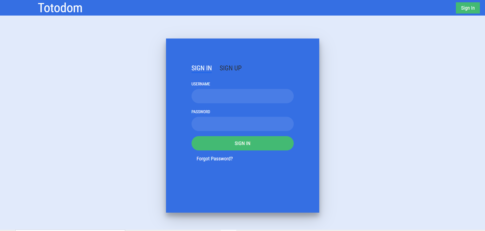
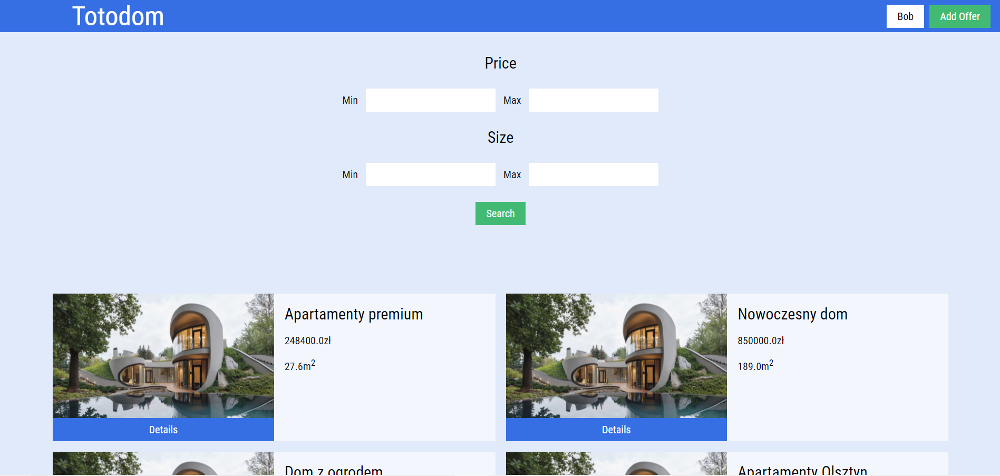
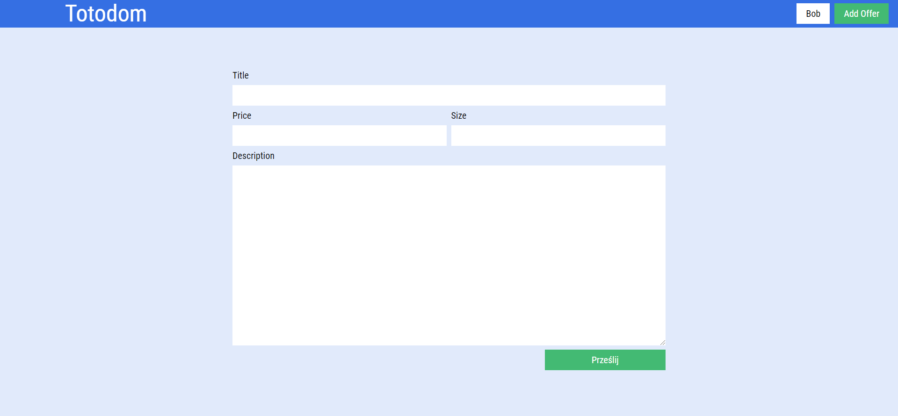
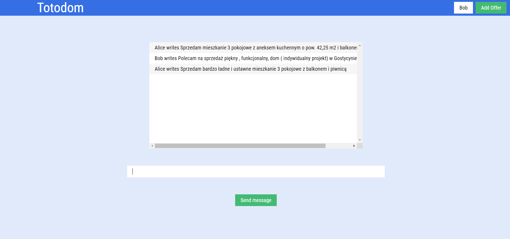

Microservice based web app using Django Docker and Kubernetes. Deployed to Google Cloud.

## Usage

run

```bash
bash build_services.sh
```

Then go to EXTERNAL-IP given by command

```bash
kubectl -n kong get service kong-proxy
```






